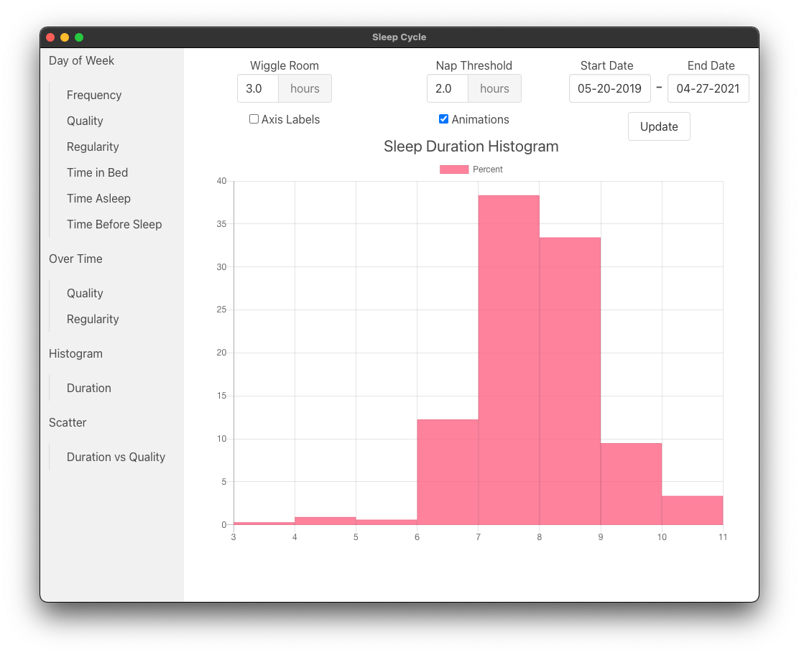
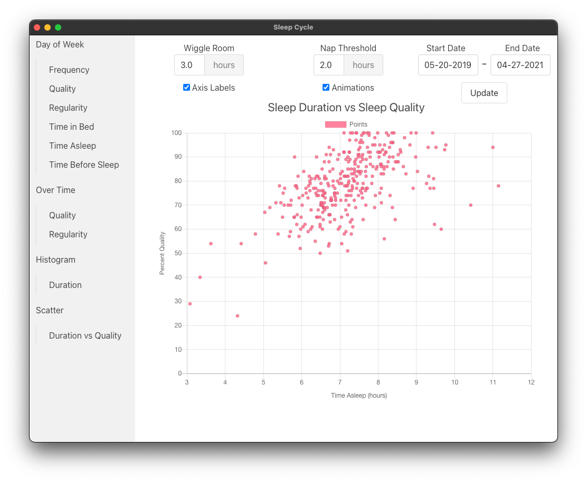
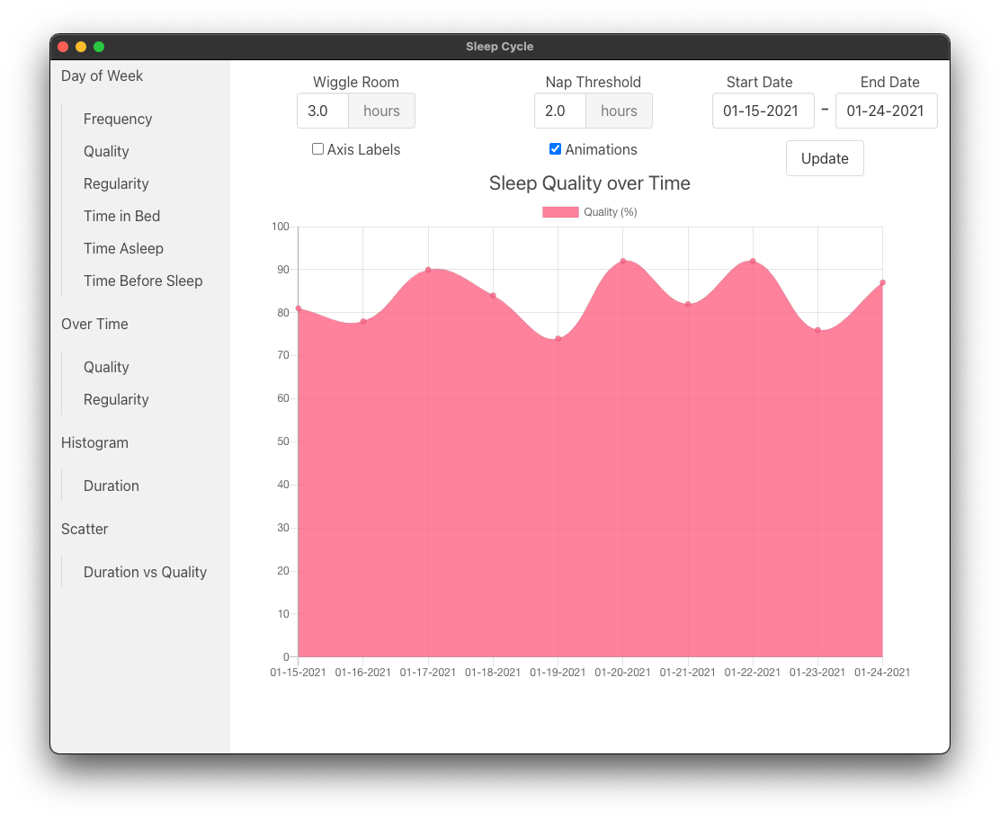

# Sleep Cycle Visualizer

Electron app that parses and displays data from the [Sleep Cycle](https://www.sleepcycle.com/) app in a visually appealing way.

## Usage

1. Download and install the desktop app from the [releases page](https://github.com/udbhav1/sleep-cycle-visualizer/releases).

2. Export your database from the Sleep Cycle app:
```
Profile -> Settings -> More -> Database -> Export Database
```
3. Move that CSV to your computer and select it when prompted in the desktop app.

If you just want to test the app, feel free to use the sample-sleepdata.csv included in the repo.

## Gallery





## Features
- Bar charts, Line charts, Histograms, and Scatterplots
- Enter custom date ranges
- Set nap threshold to ignore nights under a certain length
- Set "wiggle room" so that late nights starting up to X hours after midnight are counted as the previous day
- Toggle chart animations
- Toggle axis labels

## Development

```
git clone https://github.com/udbhav1/sleep-cycle-visualizer
cd sleep-cycle-visualizer
npm install
npm start
```
