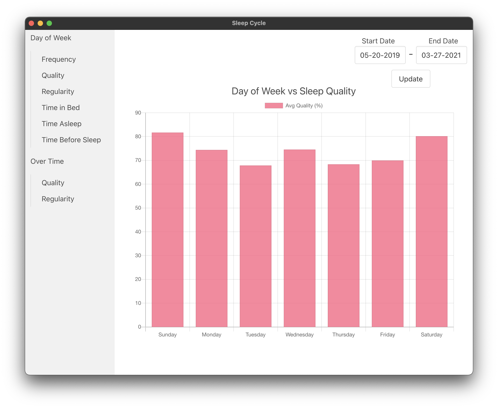
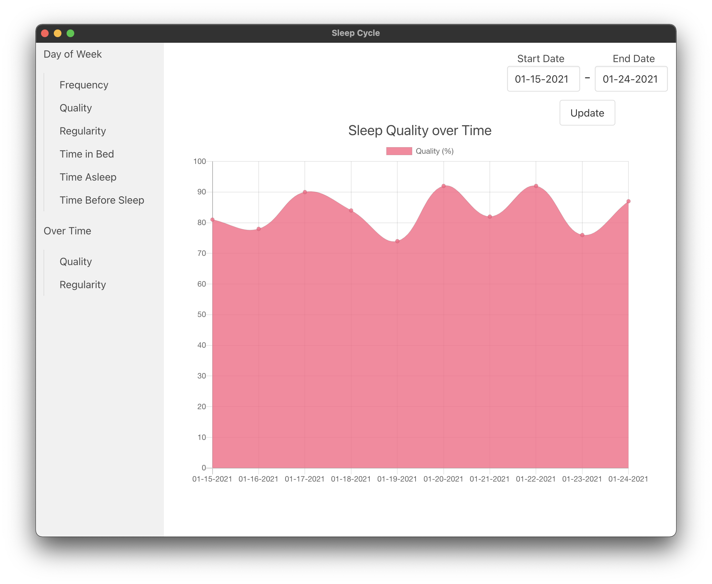

# Sleep Cycle Visualizer

Electron app that parses and displays data from the [Sleep Cycle](https://www.sleepcycle.com/) app in a visually appealing way.

## Usage

1. Download and install the desktop app from the [releases page]().

2. Export your database from the Sleep Cycle app:
```
Profile -> Settings -> More -> Database -> Export Database
```
3. Move that CSV to your computer and select it when prompted in the desktop app.

## Gallery




## Development

```
git clone https://github.com/udbhav1/sleep-cycle-visualizer
cd sleep-cycle-visualizer
npm install
npm start
```
